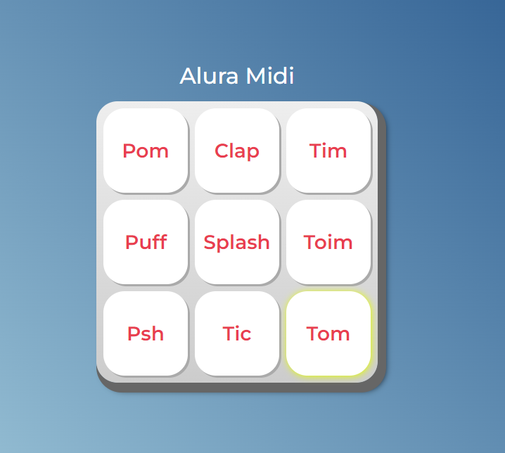

# Alura MIDI

MIDI made with JavaScript as part of a course for Web Development.

Every key has a unique sound effect that triggers when clicked or when highlighting the key then pressing enter/space

## Screenshot 

## How to Test

Clone this project using the Git command line and open the index.html file.
